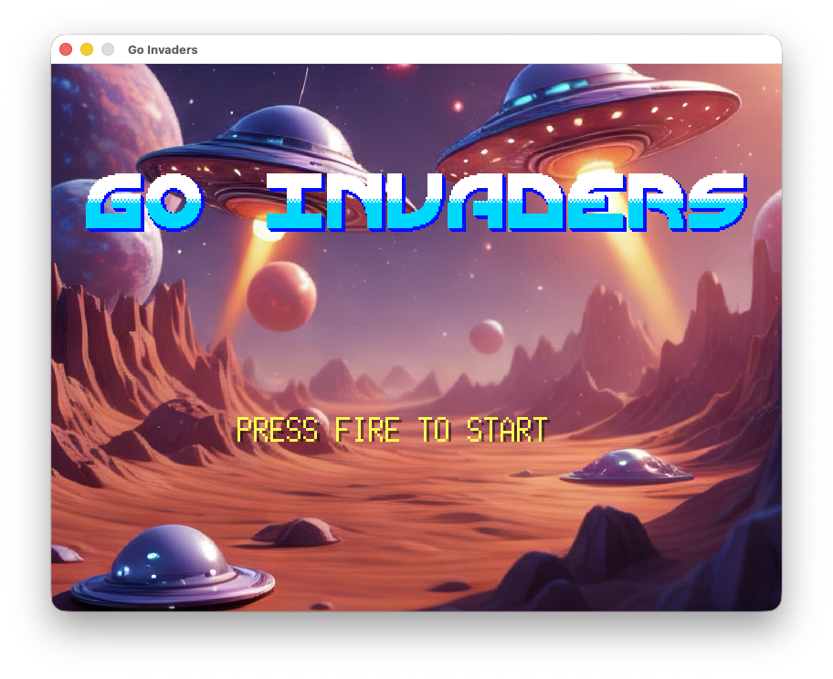
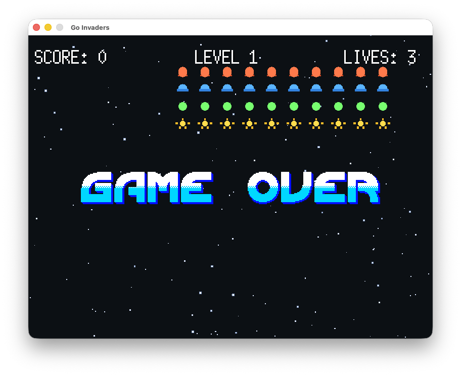

# Go Invaders

A fast, colorful Space‑Invaders‑inspired arcade shooter built with Go and Ebitengine. It features procedural effects, animated pixel art sprites, MOD music on the start screen, and a bunch of flashy particle explosions.



## Features
- Classic invader grid with score and level progression
- Animated player ship with a temporary “super‑duper” mode
- UFO fly‑bys with unique sound and crash effects
- Formation enemies with Galaxian‑style movement
- Particle explosions, smoke trails, shockwaves, and starfield
- Start screen with MOD music and Amiga‑style font rendering

## Controls
- `Left/Right` or `A/D`: Move
- `Space`: Fire / Start / Continue
- `E`: Trigger Game Over (debug)
- `F`: Hidden “kill all regular aliens” sequence

## Implementation
All code has been created by Codex (GPT5.2, Medium model in the MacApp,
Version 260206.1448 (565)).  Using planning mode for new features and
letting Codex decide how to do it. The whole game was made during an evening.

Alien sprites and sound effects was all generated by Codex, but the player
ship sprites was found on the Internet.

Music and colorful bitmap font was also found on the Internet and the start
screen image was made by Apple Intelligence in Image Playground.

See credits below for music, sprites and font.

## Build & Run
```bash
# From the repo root

go run .
```

## Compile amd64 binaray for Linux using Docker
The game still loads assets during start, so you would need to 
run the binary from the repo folder.
```bash
docker run --rm -it --platform linux/amd64 \
  -v "$PWD":/src -w /src \
  ubuntu:24.04 bash -lc '
    apt-get update &&
    apt-get install -y --no-install-recommends \
      ca-certificates git build-essential pkg-config \
      libasound2-dev \
      libx11-dev libxrandr-dev libxinerama-dev libxcursor-dev libxi-dev libxxf86vm-dev \
      libgl1-mesa-dev &&
    # install go (pick your version); simplest is apt’s:
    apt-get install -y golang &&
    go env &&
    go build -v .
  '
```

## Assets
- `assets/`: sprites, start image, font
- `music/`: MOD file for start screen playback

## Notes
- The start screen plays MOD music and shows `assets/image.png` until you press Space.
- The game uses procedural SFX and particle systems for explosions.

## Credits
- Music is an [Amiga module by Codex](https://modarchive.org/index.php?request=view_by_moduleid&query=159551)
- Player Ship sprites from [Ravenmore Industries](https://ravenmore.itch.io/space-shooter-assets-space-rage)
- Bitmap Font by [Matthew Walkden](https://pixeljoint.com/pixelart/33728.htm)


